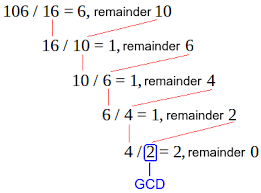

# ProblemSolvingTechniques
# Day 1:
### GCD: Greatest Common divisor. Question: 15,9 er GCD ber koro?
- ### GCD holo amn akta number : j shokol shonkha diye 15,9 k divide korle remainder 0 hoi shei shokol number er moddhe boro number ta k bole GCD. Jemon 15,9 er GCD 3. For example 106 & 16 er gcd 2.

- ### You can solve GCD using Recursion
```javascript
function gcd(a,b){
    if(a === 0) reuturn b; // ata k recursion er khetre "base case" bole
    return gcd(b % a, a) // ata k "recursive case" bole.
    // Steps for gcd(15, 9)
    /*
    Iteration 1:
        a = 15, b = 9
        b % a = 9
        Recursive call: gcd(9, 15)

    Iteration 2:
        a = 9, b = 15
        b % a = 6
        Recursive call: gcd(6, 9)

    Iteration 3:
        a = 6, b = 9
        b % a = 3
        Recursive call: gcd(3, 6)

    Iteration 4:
        a = 3, b = 6
        b % a = 0
        Recursive call: gcd(0, 3)

    Base Case Reached:
        Result = 3
    */


}
```
### LCM: least common multiple. Question: 15,9 er LCM ber koro?
- ### LCM: J shokol shonkha k amra 15,9 ai 2ta number diyey devide korer por remainder 0 ashbe, she shokol shokhar moddhe sobceye choto shonkha ta k LCM bole.
- ### 15,9 er LCM hocce 45.
- ### `LCM(a,b)×GCD(a,b)=a×b`
- ### hence,   `LCM(a,b) = (aXb) / GCD(a,b)`


